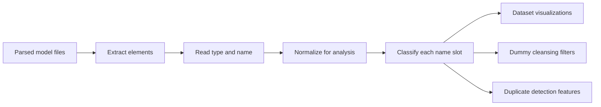

# Names, Types, and Classification

This document explains how MCP4CM reads names and types from parsed models, how it classifies names, and how those classifications are used in visualizations and dummy model cleansing.

The goal is to help users understand what the application is measuring without needing to know the backend implementation.

## Why Names and Types Matter

Most cleansing decisions depend on whether a parsed model contains meaningful vocabulary.

A model with names such as `approve invoice`, `customer`, `payment`, and `shipping address` is usually more informative than a model where most elements are named `class`, `activity`, `model`, or have no name at all.

MCP4CM therefore looks at two pieces of information for each parsed element:

- the element type, for example `class`, `activity`, `attribute`, or `operation`
- the element name, for example `customer`, `class1`, or an empty name

These are used together. A name can look meaningful on its own but still be weak if it only repeats the element type.

## Process Overview



The original parsed graph remains the main source of truth. The normalized names and classifications are analysis signals used for statistics, filtering, and comparison.

## Name Slot Classification

Every parsed element with a name field is treated as one name slot. Each slot receives exactly one classification.

| Classification | Meaning | Example |
| --- | --- | --- |
| Missing | The name is empty or unavailable. | empty name |
| Placeholder | The name is generic, generated, dummy-like, or repeats the element type. | `todo`, `test`, `dummy`, `my class`; type `class`, name `class1` |
| Semantic | The name appears to carry domain meaning. | `customer`, `approve invoice`, `shipping address` |

The classification is ordered from weakest to strongest evidence:

```text
empty name
  -> Missing

name repeats the element type, or is a known placeholder/dummy value
  -> Placeholder

otherwise
  -> Semantic
```

Type-derived names such as `Class`, `Class1`, and `DecisionNode2` are classified as placeholders because they are low-information names for cleansing purposes.

## Placeholder Names

A placeholder name is a generic value that usually does not describe the domain.

Examples:

| Element Type | Name | Classification |
| --- | --- | --- |
| `class` | `class` | Placeholder |
| `class` | `class1` | Placeholder |
| `activity` | `activity` | Placeholder |
| `decision node` | `decision node2` | Placeholder |
| any | `todo` | Placeholder |
| any | `test` | Placeholder |
| any | `dummy` | Placeholder |
| any | `my class` | Placeholder |
| `attribute` | `customer id` | Semantic |

Placeholder names are important because they often come from generated, unfinished, dummy-like, or template-like models.

## Semantic Names

A semantic name is a name that appears to describe something in the modeled domain or process.

Examples:

- `customer`
- `order`
- `approve invoice`
- `delivery address`
- `payment confirmation`

Semantic does not mean the application fully understands the concept. It only means the name is not missing and is not recognized as a placeholder.

## What "Mixed" Means in Vocabulary Views

The classification above applies to one name slot at a time.

In the Vocabulary Ranking, however, rows are grouped by name across the whole dataset. The same normalized name can appear in different contexts.

Example:

| Element Type | Name | Slot Classification |
| --- | --- | --- |
| `activity` | `activity` | Placeholder |
| `role` | `activity` | Semantic |

The vocabulary row for `activity` may therefore be shown as `Mixed`, meaning:

> this name was seen with more than one classification across the dataset.

Mixed is not a fifth slot-level class. It is an aggregate label for a name that behaves differently in different places.

## How This Appears in Visualizations

The visualizations reuse the same classification signals.

### Quality Tab

The Quality tab answers questions such as:

- How many names are missing?
- How many names are semantic?
- Which element types contain many missing or placeholder names?
- Which models are at risk because they have weak naming?

### Vocabulary Tab

The Vocabulary tab focuses on the words and names available in the parsed dataset.

It answers questions such as:

- Which names occur most often?
- Which names appear across many models?
- Which names are semantic, placeholder, or mixed?
- Are names reused broadly across the corpus or mostly unique to individual models?
- Which tokens are common for particular element types?

Useful interpretation examples:

| Pattern | Possible Interpretation |
| --- | --- |
| High occurrences, high model coverage | common corpus vocabulary |
| High occurrences, low model coverage | repeated heavily in a few models |
| Many singleton names | long-tail or model-specific vocabulary |
| Many placeholders | unfinished or dummy-like models |

## How This Supports Dummy Cleansing

Dummy cleansing uses the same name signals to decide whether a model looks too weak, generic, or artificial to keep.

Typical cleansing signals include:

- too few meaningful names
- too many missing names
- too many placeholder names
- very low vocabulary richness
- one name repeated across much of the model

The important point is that dummy cleansing is not based on a single bad name. It looks at model-level patterns.

For example:

| Model Pattern | Likely Cleansing Signal |
| --- | --- |
| Many elements named `class`, `class1`, `class2` | high placeholder ratio |
| Many names such as `todo`, `test`, `dummy` | high placeholder ratio |
| Most elements have no name | high missing-name ratio |
| Only one or two semantic names in the whole graph | too few named elements |
| One name dominates most named elements | high name repetition |

## User Perspective

When reviewing a dataset, use the classifications as evidence rather than absolute truth.

Good signs:

- many semantic names
- reusable domain vocabulary across models
- element types with characteristic but meaningful names
- low missing-name and placeholder ratios

Warning signs:

- many placeholder names
- many models with almost no semantic names
- vocabulary dominated by generic terms
- names repeated heavily within only a few models

These signals help decide whether the parsed dataset is useful as-is, needs cleansing, or contains models that should be removed before duplicate detection or further analysis.
