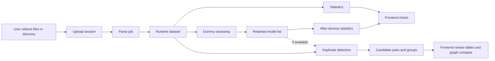
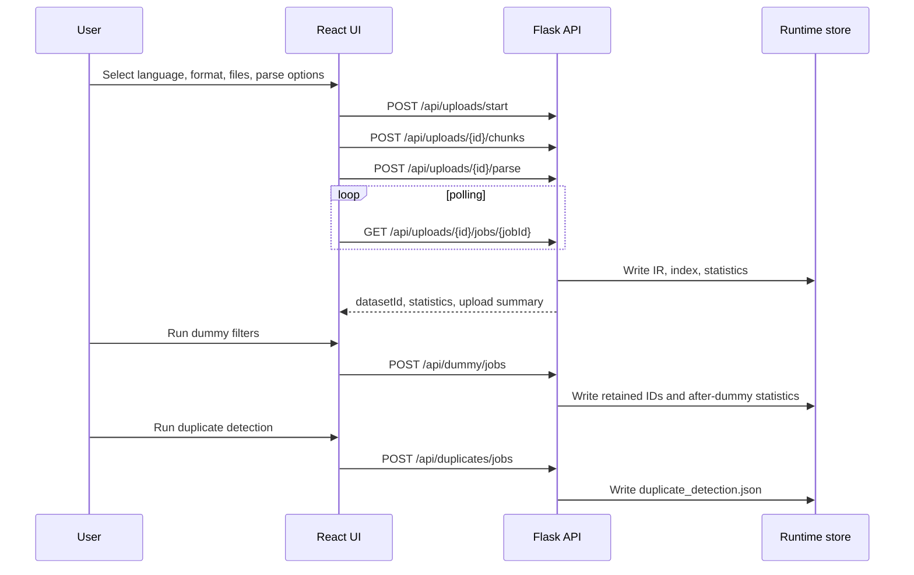
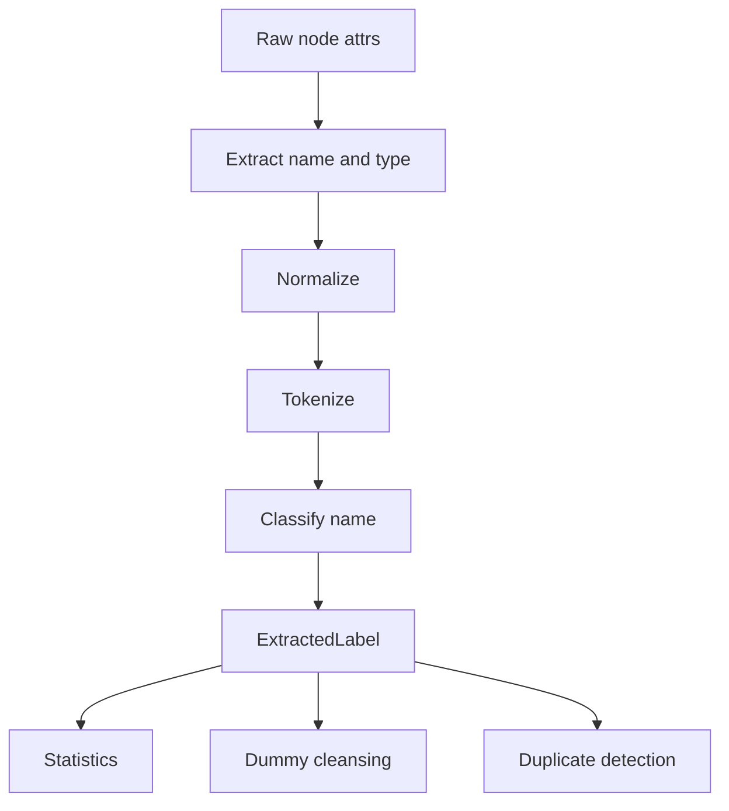
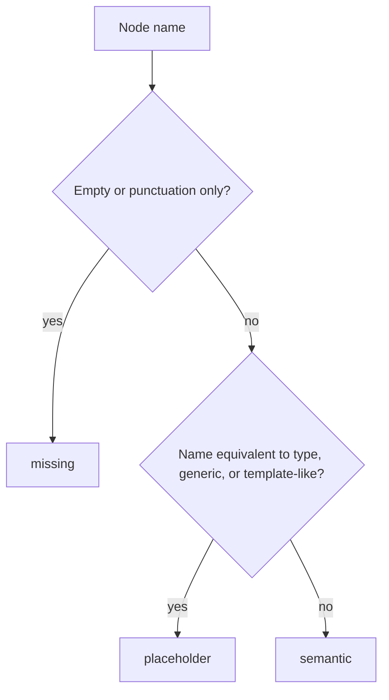
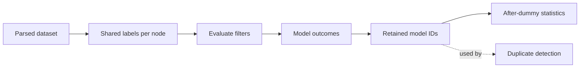
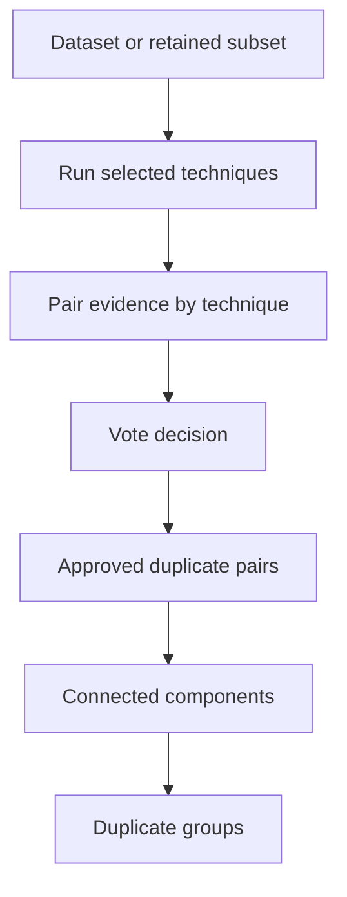
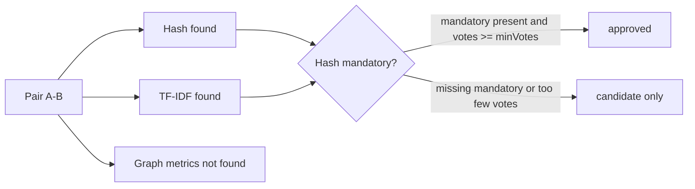
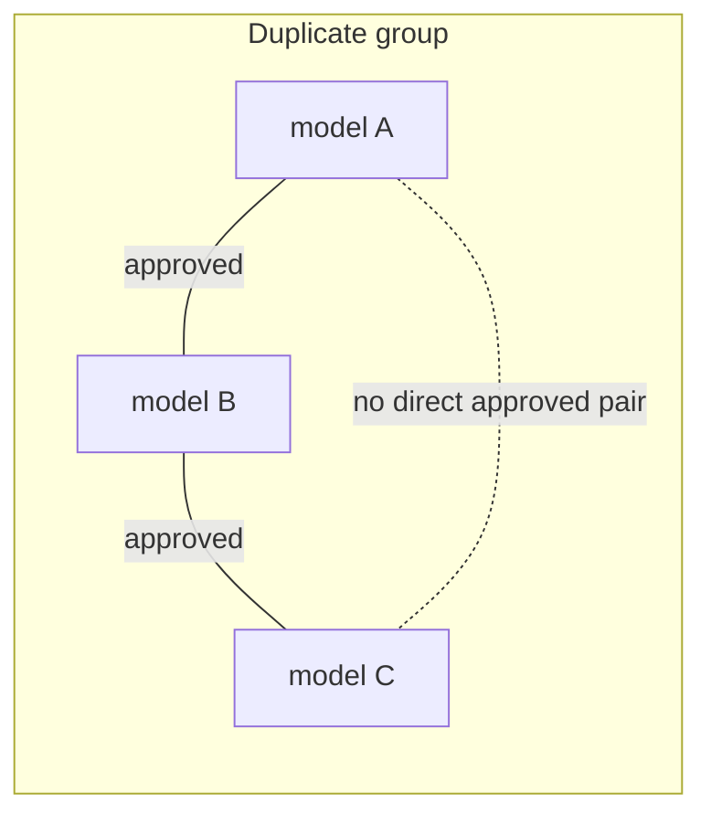

# MCP4CM Pipeline Overview

This document explains how the application processes a modeling dataset from
upload to statistics, dummy cleansing, and duplicate detection. It describes
the pipeline as implemented today, including the frontend workflow and the
runtime files produced by the backend.

For the lower-level target architecture and contract details, see
[`PIPELINE_SPEC.md`](PIPELINE_SPEC.md).

## Big Picture

The application is organized around one uploaded dataset. The frontend guides a
user through four main areas:

1. upload and parse model files;
2. inspect dataset statistics and visualizations;
3. run dummy-model cleansing filters;
4. run duplicate detection and review candidate groups or pairs.



The parser output is treated as the raw graph representation. Later stages
derive normalized views of names and types in memory, but they do not rewrite
the parsed model files.

## Runtime Files

After parsing, the backend stores dataset state under:

```text
runtime/<datasetId>/
  index.json
  ir/
    <model-runtime-file>.json
  statistics.json
  statistics-after-dummy.json
  retained-models-after-dummy.json
  duplicate_detection.json
```

The important files are:

- `index.json`: dataset metadata and one entry per parsed model.
- `ir/*.json`: serialized graph for each parsed model, including nodes, edges,
  metadata, source path, and parser diagnostics.
- `statistics.json`: statistics for the full parsed dataset.
- `retained-models-after-dummy.json`: model IDs kept after the latest dummy
  cleansing run.
- `statistics-after-dummy.json`: statistics for retained models only.
- `duplicate_detection.json`: persisted duplicate-detection result for the
  latest duplicate job on that dataset.

## Frontend Workflow

The React app is a single-page workflow with sidebar sections for upload,
statistics, dummy cleansing, duplicate detection, and inspection.



The frontend also remembers the last `datasetId` in local storage. If the
backend still has that dataset and its statistics, the UI can reconnect to it
after a page reload.

## Step 1: Input and Upload

The user chooses:

- modeling language: UML, Ecore, ArchiMate, or BPMN;
- parser format, such as UML XMI, UML JSON, Ecore `.ecore`, ArchiMate JSON, or
  Signavio BPMN JSON;
- one or more files, often as a directory upload;
- parser-specific options.

Current parser options exposed in the frontend include:

- UML XMI representation options:
  - include attributes as nodes;
  - include operations as nodes;
  - include parameters as nodes;
  - create a model-root node.
- Ecore option:
  - resolve external Ecore references.

The upload is chunked by the frontend, currently in batches of 200 files. The
backend stages files in a temporary upload directory. File paths are sanitized,
but nested relative paths are preserved where the browser provides them.

Only one active pipeline run is allowed at a time. Starting a new upload resets
the in-memory pipeline state used by the API.

## Step 2: Parsing

When the user starts parsing, the backend creates a parse job and processes all
staged files with the selected parser.

Each successfully parsed model becomes a graph-like `ModelRecord`:

- model ID;
- modeling language;
- graph nodes and edges;
- model labels and metadata;
- source path;
- raw text or XMI where available;
- parser diagnostics.

Parsers are responsible for extracting graph structure and preserving parser
observed names and types. They do not perform dummy classification or duplicate
classification. The shared name pipeline described below runs only after parse.

The parse job produces:

- a runtime IR file for each parsed model;
- `index.json` with model entries and summary fields;
- an upload summary with counts, warnings, invalid files, empty files, and
  ignored/skipped files;
- initial dataset statistics.

If parsing produces no models, the job fails with an error so the user can
check the selected language, format, parser options, and file contents.

## Step 3: Shared Label Pipeline

Statistics, dummy cleansing, and duplicate detection all use the same node-label
pipeline for node names and node types. This is the main mechanism that keeps
the later stages consistent.



For each node, the pipeline creates an `ExtractedLabel` with:

- raw name and raw type;
- normalized name and normalized type;
- ordered name tokens and type tokens;
- classification: `missing`, `placeholder`, or `semantic`.

Name extraction reads `name`. Type extraction reads `type`, with `eClass` used
only as a fallback when `type` is empty.

### Normalization

Normalization makes labels comparable without changing the raw parsed graph. It:

- trims whitespace;
- collapses internal whitespace;
- splits common identifier styles such as `CustomerOrder`, `customer_id`,
  `customer-id`, and `customer.id`;
- lowercases labels;
- converts punctuation-only labels such as `...` to an empty normalized name;
- preserves Unicode words such as accented Latin, Cyrillic, and CJK labels.

Examples:

| Raw label | Normalized label |
|---|---|
| `CustomerOrder` | `customer order` |
| `creationDate` | `creation date` |
| `get_data` | `get data` |
| `List<Order>` | `list order` |
| `PHP 7.x` | `php 7 x` |
| `...` | empty |

Some Ecore type atoms, such as `EClass`, `EAttribute`, and `EReference`, are
protected so they normalize to `eclass`, `eattribute`, and `ereference` instead
of noisy split forms.

### Tokenization

The tokenizer consumes normalized labels. By default, it:

- emits lowercase word tokens;
- keeps token order deterministic;
- drops empty tokens;
- drops numeric-only tokens;
- does not deduplicate repeated tokens unless a downstream option asks for it.

Examples:

| Normalized label | Tokens |
|---|---|
| `customer order` | `customer`, `order` |
| `php 7 x` | `php`, `x` |
| `customer customer` | `customer`, `customer` |
| `退出與取回卡片` | `退出與取回卡片` |

### Name Classification

Name classification is evaluated in this order:

1. `missing`
2. `placeholder`
3. `semantic`

Type-derived names are part of placeholder detection. For example, a node named
`Class` or `Class1` with type `Class` is a placeholder.



The classes mean:

- `missing`: no meaningful node name, such as empty text, whitespace, or
  punctuation-only labels.
- `placeholder`: low-information names such as `todo`, `dummy`, `my class`,
  `entity 1`, `attB`, `publicAttribute`, `Junction (copy)`, or type-derived
  names such as `Class1` for type `Class`.
- `semantic`: names that appear to carry domain meaning, such as
  `ShoppingCart`, `creationDate`, or `Approve invoice`.

## Step 4: Statistics

Statistics are calculated immediately after parsing. The frontend displays them
in the statistics and visualization panels.

The statistics stage summarizes:

- number of models;
- language distribution;
- raw top types and top names;
- node, edge, and name-count distributions;
- missing-name ratios;
- name-classification overview;
- semantic-name counts;
- model quality watchlists;
- vocabulary ranking and vocabulary reuse;
- element-type quality matrix;
- type-to-concept links;
- token heatmaps;
- scatter data for model vocabulary;
- optional topic-model projection for smaller datasets.

Topic modeling is skipped for large datasets and for after-dummy statistics. The
current limit for the normal topic model is 500 models.

Statistics use the shared label pipeline for name classification and token
metrics, but top raw names and raw types are still shown where useful so users
can inspect what was parsed.

## Step 5: Dummy Model Cleansing

Dummy cleansing identifies models that look too small, too generic, too
placeholder-heavy, or too weakly named to be useful for later analysis.

The frontend lets users enable or disable filters and edit thresholds. Every
run is applied fresh to the original parsed dataset. It does not permanently
delete models or rewrite parsed IR.



Dummy output includes:

- run summary: total, removed, retained, removal rate;
- filter summaries: how many models each filter removed;
- per-model outcomes;
- detailed findings with score, threshold, reason, evidence labels, and
  evidence node IDs.

### Filter Order

Filters run in a fixed order:

1. `min_size`
2. `too_few_named_elements`
3. `short_median_name_length`
4. `placeholder_name_ratio`
5. `low_vocabulary`
6. `name_repetition_ratio`
7. `regex_rule`

The frontend waterfall view is cumulative: once a model is removed by an
earlier filter, it is no longer counted as remaining for later filter summaries.
For each model, `primaryRemovalReason` is the first triggered filter, while
`allTriggeredFilters` lists every filter that would remove it.

### Built-in Filters

| Filter | What it checks |
|---|---|
| Minimum size | Node and edge counts are at least the configured minimums. |
| Naming density | There are enough semantic names. |
| Short median name | Median length of semantic names is not too short. |
| Placeholder ratio | Placeholder/non-semantic names are not too common among named nodes. |
| Low vocabulary | Semantic-name tokens contain enough unique words. |
| Name repetition | One normalized name does not dominate the model. |
| Regex rule | Optional custom regex over names, types, or name+type. |

After a dummy run, the backend writes retained model IDs and starts a background
job to compute `statistics-after-dummy.json`. The frontend polls for these
after-cleansing statistics and shows them when ready.

## Step 6: Duplicate Detection

Duplicate detection compares models and produces candidate pair decisions. If a
dummy run has produced retained model IDs, duplicate detection uses the retained
subset. Otherwise it uses the full parsed dataset.

The frontend lets users choose techniques, configure thresholds, set minimum
votes, and mark selected techniques as mandatory.



### Voting and Mandatory Techniques

Each technique can add evidence for a model pair. A pair becomes an approved
duplicate when:

- every mandatory technique selected by the user is present for that pair; and
- the number of techniques that found the pair is at least `minVotes`.

The backend also ensures `minVotes` is at least the number of mandatory
techniques and at least 1.

Example:



### Duplicate Techniques

| Technique | Purpose | Important settings |
|---|---|---|
| Hash | Exact duplicate by normalized node names, optionally including types. | Include types, minimum named nodes, deduplicate names. |
| TF-IDF | Near-duplicate text similarity using model name/type text. | Token mode, threshold, max features, min document frequency, n-grams, stopwords. |
| Graph metrics | Weighted structural similarity. | Threshold and weights for node names, node types, edge types, degree histogram, size, and density. |
| Graph embeddings | Shared Node2Vec graph embedding similarity with optional semantic feature nodes. | Threshold, dimensions, walk length, number of walks, workers, seed, node-name/type/edge-type features, pooling. |
| BERT semantic | Semantic similarity over model text. | Threshold, text mode, model name, batch size, max length. |
| Isomorphism | Exact graph-structure match. | Structure/name/name+type mode, edge-type matching, direction, parallel-edge multiplicity. |

Hash, TF-IDF, graph metrics, BERT text modes, and isomorphism name matching use
the shared label pipeline for node names and node types. Edge types are handled
separately by graph algorithms.

### Duplicate Text Modes

Several duplicate techniques can choose how model text is built:

- `names`: normalized node names only;
- `names_types_bag`: normalized names and normalized node types in one bag;
- `typed_name_pairs`: name/type pairs such as `class.shopping cart`.

Hash mode is slightly different: it builds sorted exact tokens from normalized
names, or normalized name+type pairs when type-aware hashing is enabled.

### Candidate Pairs and Groups

The raw duplicate result is a set of pair decisions. Each pair includes:

- left and right model IDs;
- whether it is approved as duplicate;
- vote count and required votes;
- techniques that found it;
- per-technique scores;
- metrics where available.

Approved duplicate pairs are then grouped into connected components. A group is
a set of models connected by approved duplicate links. Not every pair inside a
group necessarily has direct evidence; some models may be connected through
other models.

Group metadata includes:

- model IDs and size;
- approved internal pairs;
- rejected candidate internal pairs;
- missing internal pairs;
- possible internal pairs;
- density;
- confidence label;
- warning messages;
- techniques involved;
- proposed canonical model ID;
- score summary;
- model summaries.



The proposed canonical model is selected by largest graph size, then most named
elements, then stable model ID. This is a review aid, not an automatic rewrite
of the dataset.

### Group Confidence

Group confidence describes how complete or clean the evidence is:

- `complete`: every internal pair is approved and there are no rejected
  internal candidate pairs.
- `mixed`: at least one internal pair was considered but not approved.
- `weak`: at least one approved link has only one technique vote.
- `linked`: the group is connected by approved links, but not every internal
  pair has direct evidence.

The frontend provides two review modes:

- Groups: inspect connected duplicate groups and their proposed canonical model.
- Pairs: inspect individual pair decisions, filter by approval status, search,
  and compare two model graphs.

## Model Inspection

The frontend can inspect individual models or compare duplicate pairs. Inspection
uses runtime IR and returns graph nodes, edges, metadata, diagnostics, and
optionally raw attributes. This lets users check whether a warning, dummy
finding, or duplicate decision makes sense against the parsed graph.

## Important Design Points

- Parsing preserves raw graph data; name normalization and classification happen
  after parsing.
- Statistics, dummy cleansing, and duplicate detection share the same node label
  interpretation.
- Dummy cleansing is non-destructive. It records retained model IDs and derived
  statistics, but does not remove IR files.
- Duplicate detection uses the after-dummy retained subset when available.
- Duplicate groups are review structures built from approved pairs; they do not
  automatically alter the dataset.
- Frontend jobs are asynchronous and polled until completion, so large datasets
  can report progress during parsing, dummy cleansing, and duplicate detection.
